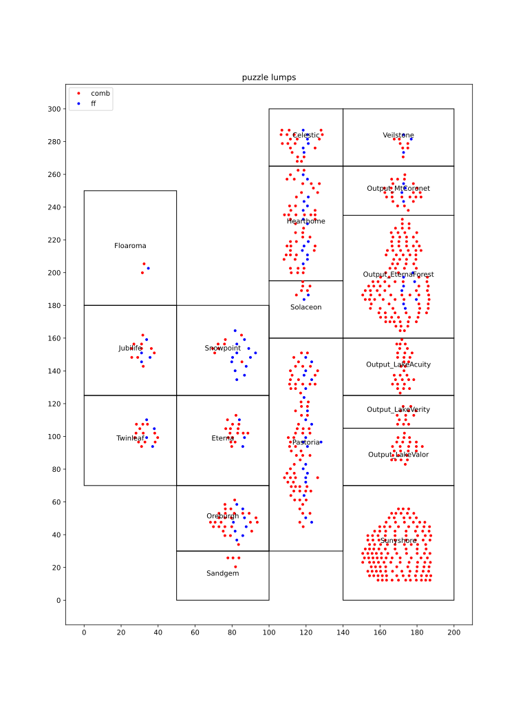
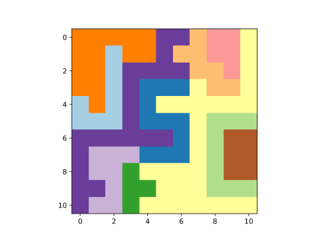
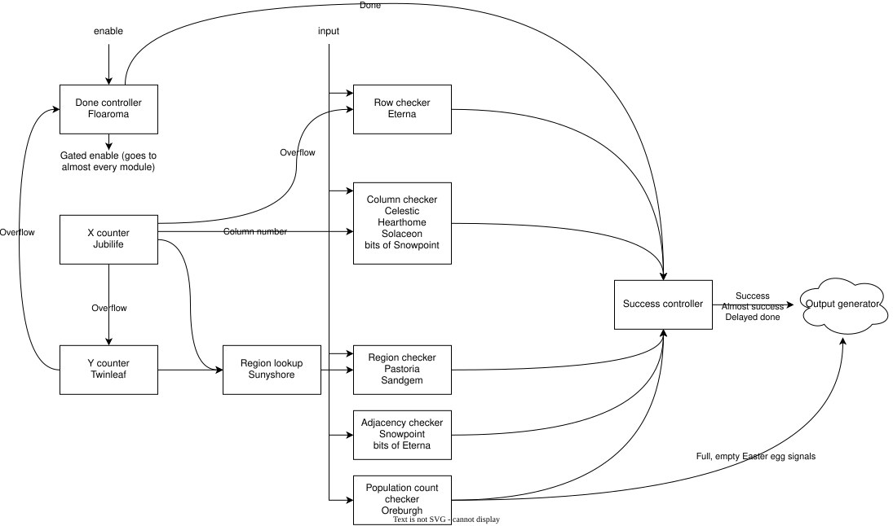

# Writeup

## Recovering the netlist

First step was to recover the netlist.
This wasn't actually all that difficult, because KLayout has a feature for it.
As soon as I entered the right settings for the technology, it had the netlist traced.
There were labels for the gate pins, as well as the external I/Os, which was a pleasant surprise.

Getting the netlist out of KLayout was fiddly, but ultimately still not that complicated.
It was awkward working in KLayout's macro thing, even if it was full Python.
I made up a custom JSON format, and I included the gates' positions, as well.
I also filtered out all the non-interesting parts, like vias, capacitors and antenna diodes.

### Checking my work

I simply took the netlist, and generated Verilog from it.
I did this for the adder demo, simulated it with random stimuli, and checked that it behaved the same as the source Verilog.
It did.

Then I took the netlist for the puzzle, and simulated that too.
It appeared to behave, it did output "TRY AGAIN" if I fed it random data.

I have also noticed that it starts outputting after 121 bits, even if I feed it more data after. I thought this was a clue - that I would find some structure that calculates `11 * 11`, or maybe `10 * 12 + 1`

## Generating something I can reverse-engineer (Amaranth)

I wanted to generate Amaranth, as I find its syntax to be more readable than that of Verilog.
I also wanted to let the computer do whatever it could to make it more understandable to me.

The plan was to turn the netlist into a representation where each gate has one output, and for all inputs, it has a reference to the gate that produces each output.
This was a good idea as long as each net is only driven by exactly driver (i. e. no tri-state drivers), which sounded fine, because none of the standard cells used here had tri-state capability.
It also assumes that each gate only has one output, but if it has multiple, it can just be split into two gates with the same inputs.
There are no full adders.

### Suddenly, mysteries

* There are 6 constant gates, where the logic could be simplified instead of usin a constant. Why?
* There is a pointless-looking buffer. Why?
* There is an *undriven net* - that's crazy, and it would probably fail DRC.
* There are some clock buffer that drive nothing. Why?

### Processing

Once I had this slightly simplified netlist, I wanted to do two transformations:
1. Remove the clock and reset nets - specifically because I wanted to get rid of the clock buffers, also clock and reset is implied in Amaranth.
2. Absorb some muxes that act as the functionality on some D flip-flops into the flip-flop itself, creating a custom cell. This got rid of 12 muxes out of 16.

I didn't do any logic minimization, so I just assembled the logical formulas for each standard cell like macros. That generated completely unmanagable files, with 300k character expressions, and the file took 41 minutes to generate Verilog. Naturally, simulating the result was out of the question.

### Lumping

I wasn't going to reverse-engineer that anyway, so I set out to take advantage of the biggest hint - that the circuit's shape hints at the function.
The circuit was made of lumps of logic - I assumed those corresponded to individual modules.
So, I cut it up, and named each lump after a city in Sinnoh (the setting of some Pokemon games).



This by itself got the longest line down to ~30k characters. Still not something I can decode by hand, but at least it doesn't break the simulator.
I also added a heuristic where if a net has a high enough fanout, it will be made into an intermediate net - I don't think this worked very well, but at least the massively long lines were gone.

As an aside, this suddenly provided a hint about the constant gates: they were never in the same module the constant value is actually used.
This to me meant that they were there because the optimizer is constrained not to change the interfaces between modules.
So, if one module outputs a constant 1 on an output, the output still needs to stay there, the wire and the consuming module doesn't get optimized based on this.
I suspect this is almost completely unrealistic at this scale, but it makes the puzzle way easier to solve.

### Simulation

I was finally able to simulate the Amaranth I have generated.
I have ended up breaking out each line that goes between modules, and compare that to the value the same net has in the verilog on each clock cycle (the gate-level netlist verilog from earlier).
This proved to be quite the reassuring testing approach.

## The actual by-hand reverse-engineering

Next up was understanding what each lump does, and replacing each lump with a nice, hand-written Amaranth module I understand.

### The git Switcheroo

I knew that I was likely to want to make changes to how I'm generating the source.
So, I checked the generated Amaranth in verbatim on master.
Then, I made a branch where I started solving the puzzle.
This way, I could just check out master again, alter my settings, and then merge master back into the solve branch, making use of git's 3-way merge.
I like to use this trick whenever I have a file that's auto-generated, but I need to keep my edits in it too.

### 11x11

I started with the simpler blocks on the left (Floaroma, Jubilife and Twinleaf) - these turned out to be a pair of cascaded 11-period counters, as well as something that cuts off the enable signal after 121 bits, an raises a done flag.
Seems like I was right about the `11 * 11` hunch earlier.

Next up I tackled the intimidating lump of combinatorial logic, Sunyshore. I had both of its inputs, but I just couldn't possibly figure out all the logical expressions. 
So, I ended up tabulating it, hoping I would notice some clever mathematical function that's really hard to implement in hardware.
Square roots, trigonometry, or maybe just a division.
I also wasn't sure which order the bits go in, so I tried all the options, and plotted each of them as an image.
Turns out that's what it was all along - an image. spelling out JSC for Jane Street Capital.
I picked a bit order that looked sensible, not he least because it made the range of the values in the image cover [0, 10], the same way the inputs do.
This however did strongly imply that the input is actually an 11x11 grid of pixels, scanned left to right, then top to bottom.



### Exactly 2

Next, I have figured out the block that generates the success output.
This told me a few things:
* There is an easter-egg to be had if I somehow solve 4 of 5 conditions, but fail the fifth one
* The top three lumps in the third column, Celestic, Hearthome, and Solaceon, are actually one block, much like Pastoria, which generates 11 outputs, and these are then and-ed together.
The and for this ended up buried in the lump I called Snowpoint.

Either of those lumps looked way too bit to tackle, so I figured out Eterna, the one that asserts that there is exactly two bit set on every row of the image.
I had some combinatorial logic left over, so I moved that out to another module.

However, I saw a pair of interacting registers in this module.
And it seemed like the two big lumps were made of 11 pairs of interacting registers.
Long stoary short, they do the same thing, just 11 times in parallel.
For the top lump, it asserts that there is two bits set in every column, the bottom lump asserts the same for evry region of the image I have recovered earlier.
I'm going to need a SAT solver for this.
That also means that in the grand scheme of things, it didn't even matter what bit order I chose for the region-lookup.

### TWO NOT TOUCH

Next I was going to tackle the module with the ovious shift register in it, Snowpoint.
I already knew this was the module that the leftover combinatorial logic from Eterna was feeding, and that this was the condition that, if failed, results in an easter egg.

Long story short, it uses the shift register to delay the incoming bits, and uses this to compare current bit to them.
So if both the current bit, and any of the ones to the left, top left, top, or top right of it are set, this condition is failed.
In other words, no two adjacent bits are set.

The interesting part here is the way it handles the edge of the grid.
(It assumes the bits outside the grid aren't set)
Each check has a separate input, coming from the leftover combinatorial logic from Eterna.
In Eterna, then, for the left and the top left, it checks that this is not the leftmost column, for the top right, it checks that it is not the rightmost column.
For the top, it checks nothing. It's the only constant 1 gate.

This suggests to me that for the 3 top neighbours, it was meant to check that this isn't the first row - but then it was realized that the shift register being reset to 0 has the same effect.
The top check was removed, and the synthesis tool inserts a buffer to prevent merging the two nets.
I don't know if that's a concession for the puzzle, or if it's a common thing done to make LVS (layout versus schematic) checking easier.

The resulting easter egg (a slightly garbled message saying "TWO NOT TOUCH") seems to be a hint - but this doesn't seem to be a particularly hard module to understand. (The corruption seems to be due to the undriven net)

### Exactly 22... Or not.

The last module proved to be a straightforward counter that increments each time there is a 1-bit shifted in.
Well, we know that there are 11 (rows, columns, regions) each with 2 bits set in it.
So there is 22 bits set.
This module indeed compares to 22, so it's redundant, right?

Well, there is two more output lines: one that compares to 0, and one that compares to 121.
Both of these lines go to the output generator.
Correspondingly, if you feed in a grid full of 0s or 1s, you get the messages "EMPTY SKY" and "BIG BANG"

### Block diagram

Here is a slightly simplifed block diagram:



## A SATisfying conclusion

I finally downloaded PyEDA, and whipped up a script to SAT-solve for all of these conditions, as well as the relaxed condition where two 1s are allowed to touch.
For the real problem, there is exactly one solution, for the relaxed one, I assume there are numerous.
I didn't try to enumerate all of them.

Solution:
```py
[
    [0, 0, 0, 0, 0, 0, 0, 1, 0, 1, 0],
    [1, 0, 0, 0, 0, 1, 0, 0, 0, 0, 0],
    [0, 0, 0, 0, 0, 0, 0, 1, 0, 1, 0],
    [1, 0, 1, 0, 0, 0, 0, 0, 0, 0, 0],
    [0, 0, 0, 0, 1, 0, 1, 0, 0, 0, 0],
    [0, 0, 1, 0, 0, 0, 0, 0, 1, 0, 0],
    [0, 0, 0, 0, 1, 0, 0, 0, 0, 0, 1],
    [0, 1, 0, 0, 0, 0, 1, 0, 0, 0, 0],
    [0, 0, 0, 1, 0, 0, 0, 0, 0, 0, 1],
    [0, 0, 0, 0, 0, 1, 0, 0, 1, 0, 0],
    [0, 1, 0, 1, 0, 0, 0, 0, 0, 0, 0],
]
```

One potential solution for Easter egg:
```py
[
    [0, 0, 0, 0, 0, 0, 0, 0, 1, 1, 0],
    [0, 0, 0, 0, 0, 0, 1, 1, 0, 0, 0],
    [0, 0, 1, 1, 0, 0, 0, 0, 0, 0, 0],
    [1, 1, 0, 0, 0, 0, 0, 0, 0, 0, 0],
    [1, 0, 0, 0, 0, 1, 0, 0, 0, 0, 0],
    [0, 0, 0, 0, 0, 0, 0, 0, 1, 0, 1],
    [0, 0, 0, 0, 1, 0, 1, 0, 0, 0, 0],
    [0, 0, 0, 0, 0, 1, 0, 0, 0, 1, 0],
    [0, 1, 0, 0, 0, 0, 0, 0, 0, 0, 1],
    [0, 0, 0, 1, 1, 0, 0, 0, 0, 0, 0],
    [0, 0, 1, 0, 0, 0, 0, 1, 0, 0, 0],
]
```

### Closure for the mystery constants

The 5 constant 0s are accounted for by the 4 string generators in the output.
These are the purely combinatorial blocks, segmented into 3 blocks named after lakes.
They print these 4 ASCII strings:
* `TRY AGAIN`
* `EMPTY SKY`
* `BIG BANG`
* `TWO NOT TOUCH`

These are all ASCII so they never have the high bit set.
Additionally, in the case for `BIG BANG`, bit 4 is never set either.

### Learnings

My big mistake was not using the logic solver earlier.
I could have made the search for enable bits better: instead of looking for an explicit mux, it could have checked if each variable in an expression, if we assume it to be 0 or 1, yield the same flipflop the expression is assigned to.
This way, counters would have stuck out like a sore thumb, and more!

### One more easter egg

It occured to me to check the example vectors for easter eggs, now that I know about the format of the input.
It turns out, there is an easter egg in there too!
If you read both of those test vectors, row-by-row, as LSB-first ASCII codes, you get this: `The night sky awaits  `

### Open questions

I don't quite undestand what that module with 8 bits state does in the middle of the output generator, but it seems to obfuscate the answer based on the input.
